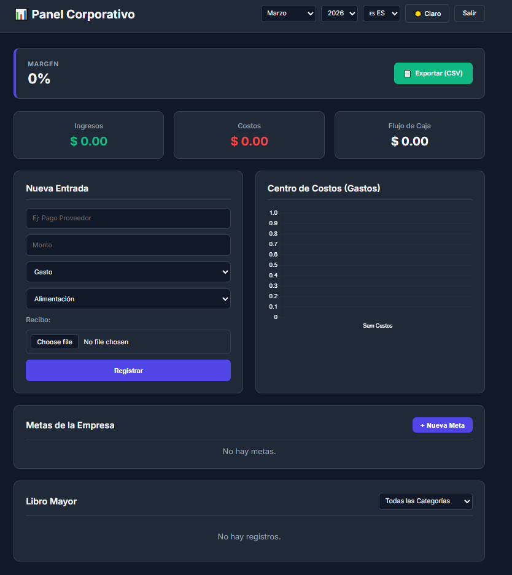

# 📊 Finance Dashboard Pro (PME)

<p align="center">
  
  
  
  
</p>

---

### 🌐 Idiomas / Languages

* [🇧🇷 Português (Atual)](#-português)
* [🇺🇸 English](#-english)
* [🇪🇸 Español](#-español)

---
### 🚀 Live Demo
**Link Oficial:** [https://finance-dashboard-zge1.onrender.com](https://finance-dashboard-zge1.onrender.com)

## 🇧🇷 Português

O **Finance Dashboard Pro** é um sistema Full-Stack robusto de gestão financeira focado em Pequenas e Médias Empresas (PMEs). Ele transforma dados brutos em inteligência de negócios, permitindo controle total do fluxo de caixa e análise de rentabilidade.

#### ✨ Funcionalidades Principais

* 🔐 **Autenticação Segura:** Login e Cadastro com criptografia de senhas e JWT.
* 📸 **Anexo de Comprovantes:** Sistema integrado com Multer para upload de notas fiscais.
* 📈 **BI Integrado:** Gráfico dinâmico de centro de custos por categoria (Chart.js).
* 📅 **Filtro Temporal:** Análise inteligente por Mês e Ano.
* 📄 **Contabilidade:** Exportação de relatórios em formato CSV (Excel).
* 🎯 **Gestão de Metas:** Definição e progresso de metas financeiras corporativas.

#### 🛠️ Tecnologias Utilizadas

* **Backend:** Node.js, Express, Nodemon.
* **Banco de Dados:** MongoDB Atlas (NoSQL).
* **Segurança & Validação:** JWT, Bcrypt, Zod, Dotenv.
* **Frontend:** HTML5, CSS3 (com Dark Mode), JavaScript (Vanilla).

#### 📸 Demonstração

<p align="center">
  
</p>

---

## 🇺🇸 English

**Finance Dashboard Pro** is a robust Full-Stack financial management system focused on Small and Medium-Sized Enterprises (SMEs). It transforms raw data into business intelligence, allowing complete control over cash flow and profitability analysis.

#### ✨ Key Features

* 🔐 **Secure Authentication:** Login and Registration with password encryption and JWT.
* 📸 **Receipt Attachment:** Integrated system with Multer for invoice uploads.
* 📈 **Integrated BI:** Dynamic cost center chart by category (Chart.js).
* 📅 **Time Filter:** Intelligent Month and Year analysis.
* 📄 **Accounting:** Report export in CSV format (Excel).
* 🎯 **Goal Management:** Definition and progress of corporate financial goals.

#### 🛠️ Technologies Used

* **Backend:** Node.js, Express, Nodemon.
* **Database:** MongoDB Atlas (NoSQL).
* **Security & Validation:** JWT, Bcrypt, Zod, Dotenv.
* **Frontend:** HTML5, CSS3 (with Dark Mode), Vanilla JavaScript.

---

## 🇪🇸 Español

**Finance Dashboard Pro** es un robusto sistema Full-Stack de gestión financiera enfocado en Pequeñas y Medianas Empresas (PYMEs). Transforma datos brutos en inteligencia de negocios, permitiendo el control total del flujo de caja y análisis de rentabilidad.

#### ✨ Características Principales

* 🔐 **Autenticación Segura:** Inicio de sesión y Registro con cifrado de contraseñas y JWT.
* 📸 **Anexo de Comprobantes:** Sistema integrado con Multer para subida de facturas.
* 📈 **BI Integrado:** Gráfico dinámico de centro de costos por categoría (Chart.js).
* 📅 **Filtro Temporal:** Análisis inteligente por Mes y Año.
* 📄 **Contabilidad:** Exportación de informes en formato CSV (Excel).
* 🎯 **Gestión de Metas:** Definición y progreso de metas financieras corporativas.

#### 🛠️ Tecnologías Utilizadas

* **Backend:** Node.js, Express, Nodemon.
* **Base de Datos:** MongoDB Atlas (NoSQL).
* **Seguridad y Validación:** JWT, Bcrypt, Zod, Dotenv.
* **Frontend:** HTML5, CSS3 (con Dark Mode), Vanilla JavaScript.

---

## 🚀 Como Executar o Projeto (Local)

1.  **Clone o repositório:**
    ```bash
    git clone [https://github.com/SEU-USUARIO/finance-dashboard.git](https://github.com/SEU-USUARIO/finance-dashboard.git)
    cd finance-dashboard
    ```

2.  **Instale as dependências:**
    ```bash
    npm install
    ```

3.  **Configure o ambiente (`.env`):**
    Crie um arquivo `.env` na raiz baseado no modelo enviado e adicione suas chaves.

4.  **Inicie o servidor:**
    ```bash
    node server.js
    ```

5.  **Acesse no navegador:**
    `http://localhost:3000`

---

Developed with ❤️ by [Henrique](https://github.com/M3nriquez).